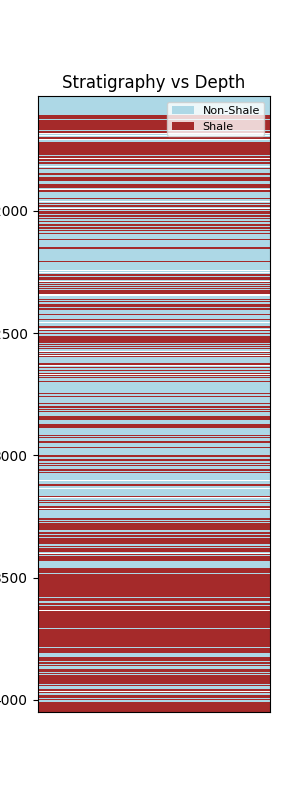
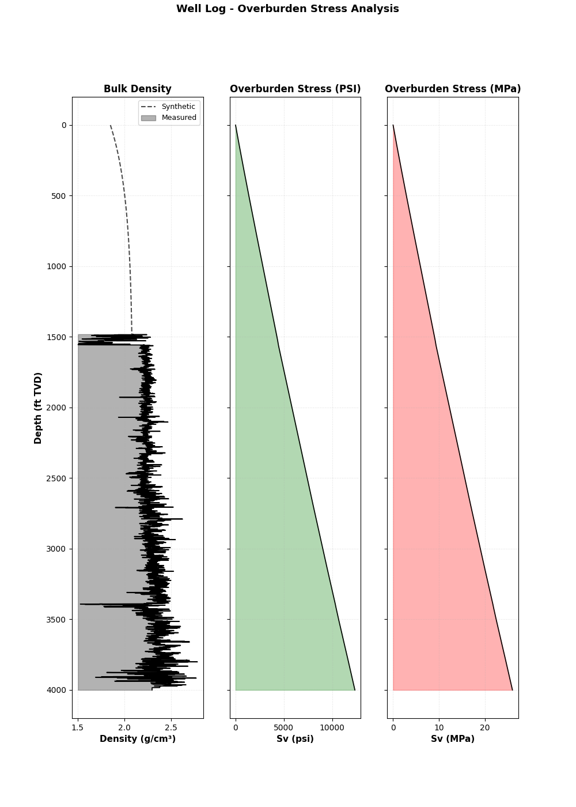
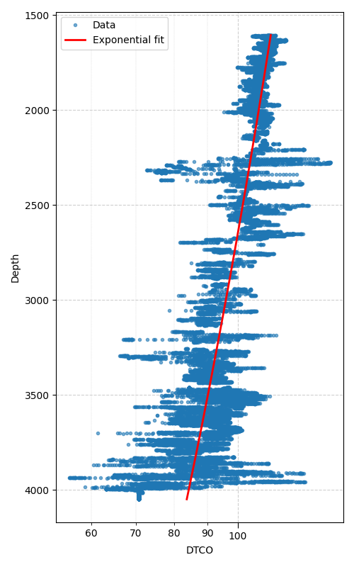
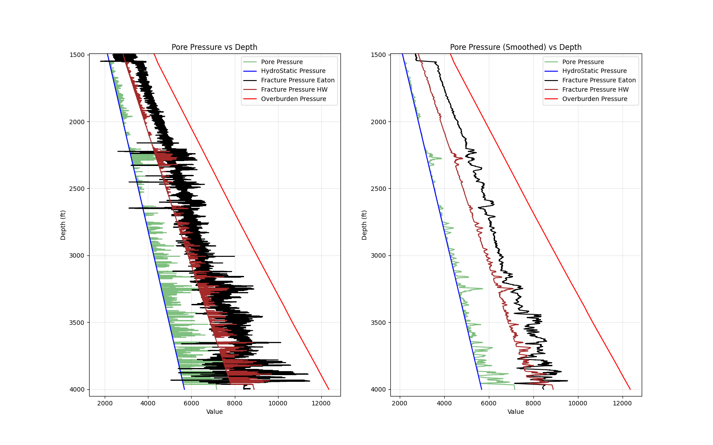

# pyGeoMechanics Documentation

## Overview

The `pyGeoMechanics` library is a Python-based solution for geomechanical computations. It provides modular components for data ingestion, preprocessing, overburden stress calculations, pore pressure analysis, stratigraphy modeling, trajectory analysis, and utility functions. The architecture supports seamless integration into enterprise geomechanical workflows.

### Directory Structure

```
Custom_library/
├── runner.py            # Workflow orchestrator
├── Ingestion.py         # Data ingestion and parsing
├── Preprocessing.py     # Data cleaning and preparation
├── Overburden.py        # Overburden stress computation
├── Pore_pressure.py     # Pore pressure analysis
├── Stratigraphy.py      # Stratigraphy layer modeling
├── Trajectory.py        # Wellbore trajectory analysis
├── Utils.py             # Utility functions
└── requirements.txt     # Project dependencies
```

## Installation and Setup

### 1. Install Dependencies

```bash
pip install git+https://github.com/abhishake99/pyGeoMechanics.git

```

### 2. Configuration Parameters

The `executor.py` script accepts the following parameters:

| Parameter | Type | Description |
|-----------|------|-------------|
| `las_folder_path` | str | Directory containing LAS files, **Note:** please provide the unprocessed/raw LAS files only. |
| `trajectory_file_path` | str | CSV file path with columns: md, azi, inc |
| `tvd_csv_path` | str | Output filename for TVD data |
| `rkb` | float | Rotary Kelly bushing elevation (m) |
| `tvd_sample_rate` | float | Depth sampling interval (default: 0.01 m) |
| `geological_zones` | dict | Zone definitions with depth and GR cutoff ranges |
| `area_type` | str | Geographic context: `'onshore'` or `'offshore'` |
| `gap_fill_method` | str | Density interpolation: `'exponential'` or `'linear'` |
| `nct_type` | str | Normal compaction trend: `'semilog'` or `'poly'` |
| `outlier_ranges` | dict | Valid ranges for log curves |

#### Example Configuration

```json
{
    "geological_zones": {
        "ZONE_1": {"dept": [0, 2500], "gr": [25, 120]},
        "ZONE_2": {"dept": [2501, 4500], "gr": [25, 120]}
    },
    "outlier_ranges": {
        "DTCO_merged": [40, 150],
        "DTSM_merged": [60, 360],
        "RHOB_merged": [1.2, 3.0],
        "GR_merged": [0, 250]
    }
}
```

### 3. Execution Workflow

```python 
from pyGeoMechanics.runner import run_geomechanics

run_geomechanics(las_folder_path=r"...\2. Well Logs\BRK012 Raw Logs",
        trajectory_file_path=r'...\BRK012_Survey _wellpathy.csv')
```

The application executes the following sequence:

1. Data ingestion via `Ingestion.py`
2. Data preprocessing via `Preprocessing.py`
3. Geomechanical analysis using `Overburden.py`, `Pore_pressure.py`, `Stratigraphy.py`, `Trajectory.py`
4. Results export to `Data` output directory containing plots as PNG and data in CSV format

### Output Examples

- **Stratigraphy**: 
- **Overburden Stress**: 
- **Normal Compaction Trend**: 
- **Pore Pressure**: 

## Module Reference

| Module | Purpose |
|--------|---------|
| **Ingestion.py** | Reads and parses input data (CSV, LAS, Excel) |
| **Preprocessing.py** | Data validation, cleaning, and normalization |
| **Overburden.py** | Calculates vertical stress profiles |
| **Pore_pressure.py** | Computes pore pressure magnitudes |
| **Stratigraphy.py** | Models stratigraphic sequences and properties |
| **Trajectory.py** | Processes wellbore deviation surveys |
| **Utils.py** | File I/O |
| **runner.py** | Orchestrates module execution and data flow |
